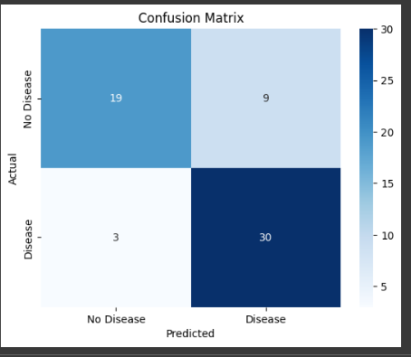

# Heart Disease Detection using Logistic Regression

## Project Overview
This project applies **Logistic Regression** to predict the presence of **heart disease** in patients based on clinical attributes. Logistic Regression is a widely used statistical method in healthcare analytics due to its interpretability and ability to model binary outcomes.

The model classifies individuals into:
- **0 → No Heart Disease**
- **1 → Presence of Heart Disease**

---

## Dataset
- **Source:** [Kaggle – Heart Disease Dataset](https://www.kaggle.com/code/prasenjitsharma/beginner-heart-disease-prediction/input?select=heart.csv)  
- **Patients (rows):** 303  
- **Features (columns):** 13 input variables + 1 target variable  

### Example Features
- Age  
- Sex  
- Chest Pain Type (`cp`)  
- Resting Blood Pressure (`trestbps`)  
- Cholesterol (`chol`)  
- Maximum Heart Rate (`thalach`)  
- ECG results (`restecg`)  
- ST depression (`oldpeak`), etc.  

---

##  Workflow
1. **Data Understanding**  
   - Loaded dataset using Pandas  
   - Checked shape, columns, and missing values (dataset is clean)  

2. **Visualization & Insights**  
   - Target distribution → balanced dataset  
   - Correlation heatmap → chest pain type, max heart rate, ST depression are key predictors  

3. **Data Splitting**  
   - Train-test split: 80% training, 20% testing  
   - Stratified sampling to preserve class balance  

4. **Model Training**  
   - Logistic Regression with `max_iter=1000`  

5. **Evaluation Metrics**  
   - Accuracy, Precision, Recall, F1-score, Confusion Matrix  

---

##  Model Performance
- **Accuracy:** ~82%  
- **Precision:** ~83%  
- **Recall:** ~81%  
- **F1-score:** ~82%  
- Training and test scores are similar → no overfitting  

---

##  Output



---

##  Key Insights
- Logistic Regression is effective and interpretable as a baseline model.  
- **Important predictors:** chest pain type, maximum heart rate, and ST depression.  
- Model balances recall (detecting true cases) and precision (avoiding false alarms).  

---

## 🖥️ Installation & Usage

### 1. Clone the repository
```bash
git clone https://github.com/Sanjana741/APR_Assignment1.git
cd heart-disease-prediction
